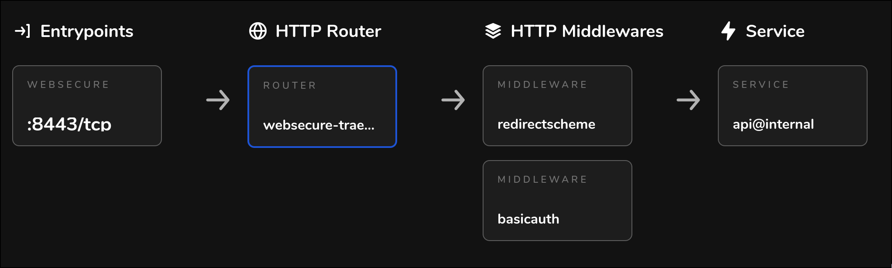

+++
title = "Cloud Computing with EKS: Foundations"
date = 2024-05-25
[taxonomies]
tags = ["AWS", "EKS", "Kubernetes", "DevOPS", "Terraform"]
[extra]
add_src_to_code_block = true

+++

This series of posts is an opinionated tutorial for setting up production-grade Kubernetes clusters & deployments on AWS. [^1] It aims to be as detailed and correct as possible and will provide complete pieces of relevant source code. 

This tutorial is split into 2 parts. The first part is devoted to creating EKS & supporting infra, and the second part describes Dagster installation.

# Introduction

In the Data & ML space, we often encounter workloads with high computational requirements. Kubernetes is a natural choice for running such workloads, because it provides near to infinite customization options and scalability. 

We will be using EKS (managed Kubernetes service in AWS) to deploy Dagster - an excellent Data Orchestrator with a unique declarative, asset-based programming model.  It's an ideal choice for batch processing workloads. Dagster can be deployed on Kubernetes, which enables it to orchestrate data processing at massive scale. 

Here is what we would like to achieve:
- Have an auto-scaling Dagster deployment running on Kubernetes
- Leverage cheap Spot instances for up to 90% costs reduction
- Have secure external access to this deployment (OSS Dagster doesn't have built-in authentication)
- Have automatic Dagster Branch deployments for Pull Requests

We will leverage various free & Open Source tools in order to achieve this [^2]. The tools we are going to use are:

- Terraform to create the EKS cluster and other supporting infrastructure
- Karpenter for auto-scaling EC2 (spot) instances
- Cert Manager for getting free SSL certificates from Let's Encrypt
- Traefik as a reverse proxy & simple Basic Auth middleware for Dagster's Webserver
- NodeLocal DNSCache for reducing load on AWS DNS servers (it's actually quite easy to overload them!)
- ArgoCD to deploy Dagster and automatically create Branch Deployments for Pull Requests

# Who scales the autoscaler?

For all things AWS, we will be using the amazing `terraform-aws-modules` Terraform modules. They provide pre-configured AWS resources for common use-cases.

Let's start by creating the EKS cluster:

{{ add_src_to_code_block(src="terraform/eks/main.tf") }}
```terraform
{{ remote_text(src="blog/cloud-computing-eks-part-1/src/terraform/eks/main.tf") }}
```

Notice how the cluster only has a single Node Group. This is because we are going to be using Karpenter for node provisioning.

[Karpenter](https://karpenter.sh/) is a feature-rich and easy to use Kubernetes autoscaler. It allows defining `NodePool`s and other objects as Kubernetes Custom Resources via simple YAML.

While being really great, Karpenter pods can't magically appear in our cluster out of nowhere, so sadly they need an initial NodeGroup to run on. Afterwards, Karpenter will launch additional EC2 instances to join the cluster to satisfy Pod scheduling needs. 

Currently, Karpenter only works with AWS EKS, but the project is aiming to support other cloud providers in the future.

Karpenter is aware of Kubernetes [well-known](https://kubernetes.io/docs/reference/labels-annotations-taints/) labels (such as OS, CPU architecture, ...) and aws-specific labels (such as `instance-type`, `instance-size`, ...) is aware of instance pricing, can drain Kubernetes nodes running on spot instances ahead of node termination, and much more. This enables configuring really flexible auto-scaling `NodePool`s. 

Let's install Karpenter to our cluster and add a default `NodePool`. We will be using the community [kubectl](https://github.com/alekc/terraform-provider-kubectl) Terraform provider to create Karpenter's Custom Resources (CRs), since the other official provider - [kubernetes](https://github.com/hashicorp/terraform-provider-kubernetes) - [does not properly support CRs](https://github.com/hashicorp/terraform-provider-kubernetes/issues/1367), so we are left with whatever actually works. 

{{ add_src_to_code_block(src="terraform/eks/karpenter.tf") }}
```terraform
{{ remote_text(src="blog/cloud-computing-eks-part-1/src/terraform/eks/karpenter.tf") }}
```

This is how we can add a `NodePool` for spot instances:

```yaml,hl_lines=8
    ...
    spec:
      template:
        spec:
          requirements:
            - key: karpenter.sh/capacity-type
              operator: In
              values: ["spot"]
    ...
```

if requirement `karpenter.sh/capacity-type` is set to math both `"on-demand"` and `"spot"`, then Karpenter will prefer spot instances and automatically fallback to on-demand during shortages. 

The last component to complete the hyper scaling setup is NodeLocal DNS Cache. It's really important to set it up, otherwise launching more than ~500 pods will result in frequent `Temporary Name Resolution Failure` when accessing AWS services such as `S3` or `RDS`. 

{{ add_src_to_code_block(src="terraform/eks/node-local-dns.tf") }}
```terraform
{{ remote_text(src="blog/cloud-computing-eks-part-1/src/terraform/eks/node-local-dns.tf") }}
```

I haven't included supporting Terraforms files (`providers.tf`, `variables.tf` and `outputs.tf`) above since they are self-explanatory. 

Now, let's get to the ingress LoadBalancer setup.

# Cloud District

We are aiming to expose (securely) our Kubernetes services to the outside world, and we are not running away from Load Balancers, various middlewares, autentication, route management, SSL certificates, and so on. 

Traefik and Cert Manager are the two mainstream free and open source Kubernetes applications  often used to solve this kind of problems. I will give a brief explanation below, but the reader is welcome to dive into their documentation.

[Traefik](https://traefik.io/traefik/) is a reverse proxy which can be deployed with it's own Load Balancer. It can then route traffic from this Load Balancer to other Kubernetes services. It can be used to inject various useful middlewares which can do stuff like `https -> http` redirect, rate limiting, basic auth, modify request paths, etc. The full list can be found [here](https://doc.traefik.io/traefik/middlewares/http/overview/). It also allows to automatically provision SSL certificates and supports free services such as [Lets Encrypt](https://letsencrypt.org/). It allows doing all of this via Kubernetes CRs. Load Balancers can get quite expensive, and Traefik allows easily using a single Load Balancer for all your services. It also has a great dashboard!

While Traefik can generate SSL certificates out of the box, we will be using a separate solution for that - [Cert Manager](https://cert-manager.io/). This way we are not too reliant on Traefik, and Cert Manager is actually more versatile (since issuing certificates is it's primary job).

Both Traefik and Cert Manager can be deployed without Terraform, but using Terraform allows automating the registration of the `CNAME` record for Traefik's Load Balancer, which is a crusial step when provisioning new EKS clusters. 

Seems like a match made in ~~the cloud~~ heaven!

Let's start with Cert Manager:

{{ add_src_to_code_block(src="terraform/eks/cert-manager.tf") }}
```terraform
{{ remote_text(src="blog/cloud-computing-eks-part-1/src/terraform/eks/cert-manager.tf") }}
```

We installed the `cert-manager` Helm chart into `cert-manage` namespace and create a `ClusterIssuer` for the `DNS-01` challange. This challenge requires creating a given TXT record for the claimed domain, so `cert-manager`'s pod will need access to certain Route53 policies in order to create this record on Let's Enctrypt's demanbd. This is covered by creating an IAM role for `cert-manager` and providing the role's name as Kubernetes Service Account annotation.

Let's continue by installing Traefik. 

{{ add_src_to_code_block(src="terraform/eks/traefik.tf") }}
```terraform
{{ remote_text(src="blog/cloud-computing-eks-part-1/src/terraform/eks/traefik.tf") }}
```

We installed the `Traefik` helm chart into `traefik` namespace. We annotated the Service with `service.beta.kubernetes.io/aws-load-balancer-type: nlb` to create an AWS external LoadBalancer, and created CNAME DNS records in AWS Route53 to route web requests to our domain to this LoadBalancer.

Notice how the chart has the default `IngressRoute` disabled. Instead, we are going to create a custom one. 

First, we create a `Certificate` - a CR provided by Cert Manager - claiming to own the domain `traefik.${local.cluster_subdomain}.${var.domain}`. Once the `Certificate` is created, Cert Manager's Controller pod will notice it and start the domain verification process agsinst Let's Encrypt by using the `DNS-01` challange. Let's Encrypt will give Cert Manager a secret token and ask it to expose it via TXT DNS record. Cert Manager will create this AWS Route53 record, thus proving our domain ownership to Let's Encrypt, and the `Certificate` is going to be issued and stored in a corresponding `Kubernetes` Secret.

We then reference this Secret in the `IngresRoute` - a CR provided by Traefik. We also create and reference a bunch of supporting resources, such as Basic Auth middleware, and store the password for it in AWS Secrets Manager. 

Phew! After running `terraform apply`, a bit of patience and some tears, we should be able to: 
- inspect the created AWS Secrets Manager secret for Traefik Dashboard to retrive the Traefik Dashboard password
- access the Traefik Dashboard at `https://traefik.k8s-{region}-{cluster}.domain.com/dashboard/` (the training slash is **important**)

The dashboard allows inspecting the created routes for more details:



This completes Part 1. We now have a production-ready EKS cluster with flexible external access configuration and basic auth set up. 

---
[^1] While this tutorial is tailored for AWS, only Karpenter from all the used tools is AWS-specific. However, Karpeneter is aiming to support other clouds in the future. 
[^2] The only proprietary component is AWS EKS itselt.
