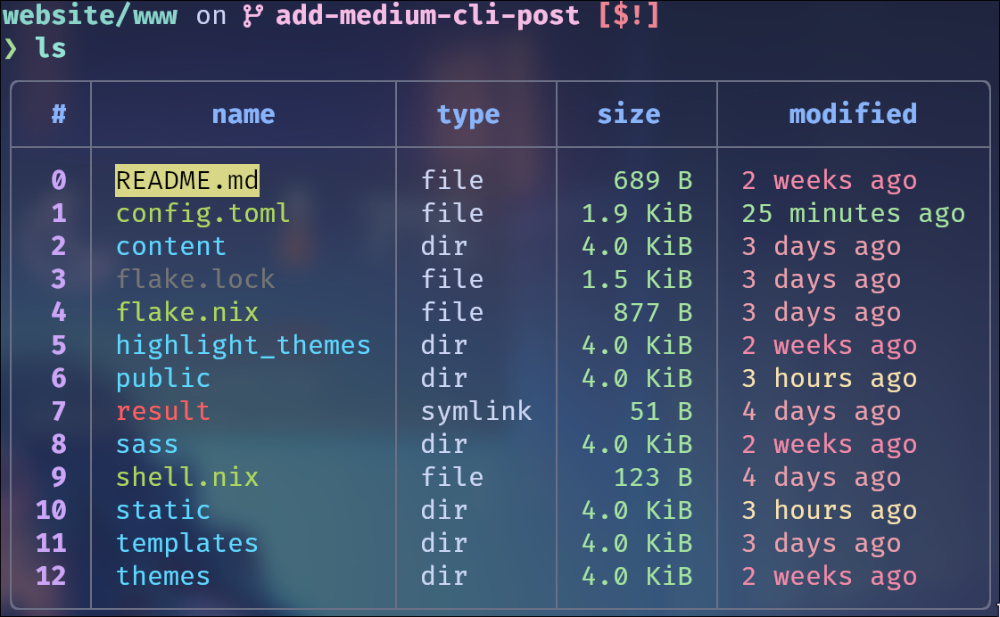
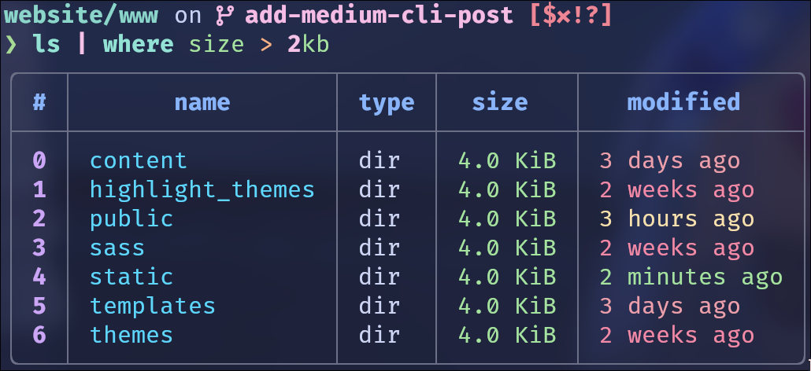
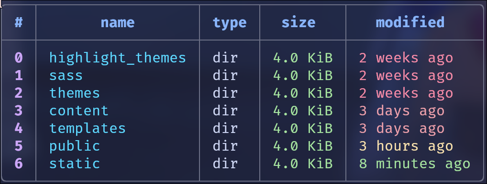
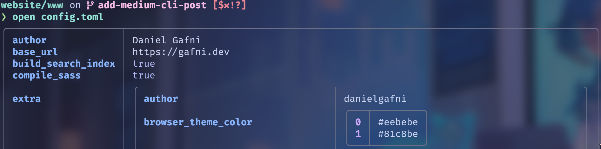
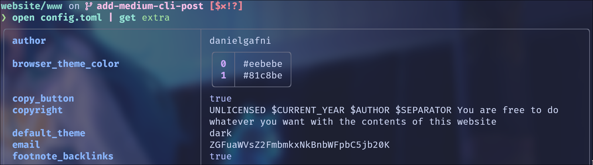
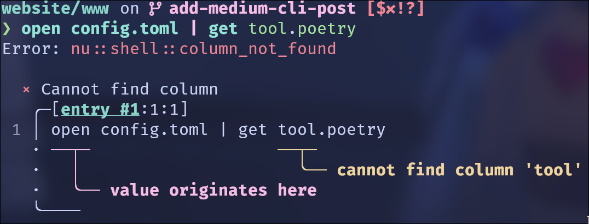
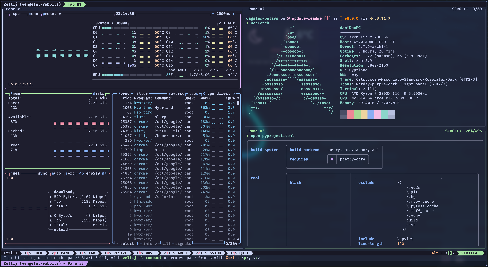
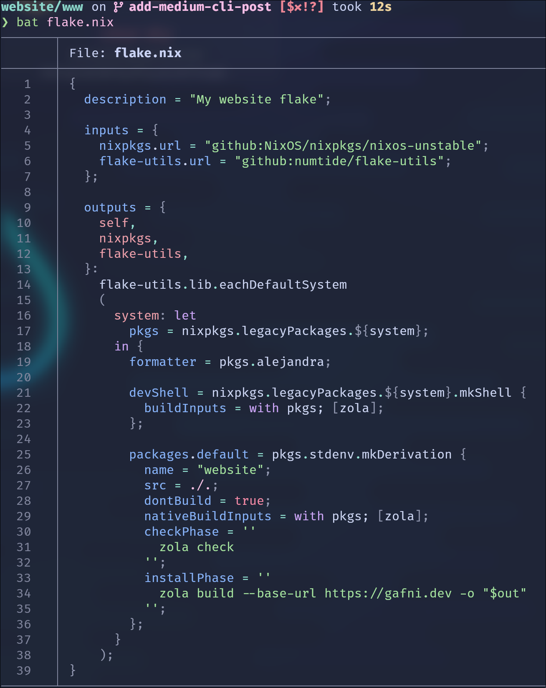

+++
title = "The Modern CLI Stack"
date = 2024-03-25
[taxonomies]
tags = ["cli", "linux", "development"]

[extra]
social_media_card = "./static/img/social_cards/blog_modern_cli_stack.jpg"
+++

## Introduction

This is an export of my old 2022 Medium [article](https://danielgafni.medium.com/the-modern-linux-cli-stack-46253688b53d). I've slightly modified it with new examples and changed some wording here and there. The tools mentioned in the article have stood the test of time in 2024!

---

This post is about the awesome {{ spoiler(text="Rust", fixed_blur=false) }}-based **cross-platform** CLI ecosystem which I’ve discovered recently. All of them share the same nice properties: they have rich defaults, convenient configuration formats, and are cross-platform. Adopting them made me feel better about my dev workflows :) 

My new stack vs the old stack:

| Stack | Shell         | Prompt          | Terminal Multiplexer |
| --- | --------------- | --------------- | -------------------- |
| New | `nushell`       | `starship`      | `zellij`             |
| Old | `zsh/antigen`[^1] | `powerlevel10k` | `tmux`               |

The old stack is very basic and commonly found at `/r/unixporn` subreddit (at this point I’ve been using it for ricing my Linux setup for more than 2 years).

So, the new stack doesn’t even have a shell plugin manager? Yes! Seems like no shell plugins are needed [^2]. All the mentioned tools already implement everything one can need. Even more, they **rarely need any configuration at all**! Of course, they are very configurable, but unlike many old tools they don’t use obscure config files with tool-specific syntax. Instead of that, normal `yaml` or `toml` files are used.

After trying them out I immediately decided there was no going back.

In this post I will not describe the installation or configuration of these tools (you can always read the docs), but rather highlight the **key features** and explain the **benefits** over the traditional tools.

## Nushell

[Nushell](https://www.nushell.sh/), or `nu`, is a modern data-oriented shell written in Rust. It requires almost zero configuration to start working with it, even though a lot can be configured, has syntax highlighting, auto-completion and other useful features enabled by default. It implements all shell commands (like `ls`, `cat`, etc), but in a very special way - they are now aware of their inputs and outputs content. Lets take a look at this examples.

List files in the current directory:

Filter by file size:

And sort by modified timestamp:

As we can see, `nu` stores the data representation (in this case the `ls` command output) as a table, while `bash/zsh` `ls` outputs simple text. In fact, the way these tables are rendered can seem familiar to some of you… yes, `nu` is using `polars.DataFrame` internally!

The same can be applied to any file, even with nested structure (not showing the full output here):

And now access a field:

This is extremely useful when working with `yaml` , `toml` , `json` , `csv` and other structured files. No need to use `grep`, `jq` or enter `vim` !

Another positive side of `nu` is it's **error handling**.

The shell is clearly pointing us at the error source.

---

**Nu DataFrames: a bonus for a Data Scientist**

Because `nu` is using `polars` internally, it has first class [support](https://www.nushell.sh/book/dataframes.html) for tabular operations, and it is possible to perform them from the shell directly! Of course, this outperforms `pandas` by orders of magnitude. A lot of complex operations on data can be performed without opening Jupyter at all.

By the way, `nushell` is officially supported by `Poetry` since `1.2.0`.

## Starship

[Starship](https://starship.rs/) is a terminal prompt written in .. yes, in {{ spoiler(text="Rust", fixed_blur=false) }}
. It makes in very fast (actually, this is not an improvement over `powerlevel10k` since it’s written in C++). Starship has very rich configuration options in a simple `yaml` file. But, just like `nushell` , it doesn't _need_ any configuration initially - all the defaults are already set! It also provides nice ready-to-use config [presets](https://starship.rs/presets/#nerd-font-symbols).

Starship automatically integrates with multiple other tools & technologies. It can display package versions (for example, when in a `Poetry` project), show AWS region, kubernetes context & namespace.. in short, it works with everything. Take a look at the full list of integrations [here](https://starship.rs/config/#prompt).

Of course, it also looks good. Here is the default prompt with no configuration:

## Zellij

[Zellij](https://zellij.dev/) is a terminal multiplexer written in Python. Kidding, it’s actually written in R…. Rust. It’s very similar to `tmux`, and even supports `tmux` commands, but has some user-friendly advantages:

1.  Operation [modes](https://zellij.dev/documentation/keybindings-modes.html): pane, tab, resize, etc…
2.  The panes are mouse-scrollable and mouse-clickable
3.  [Layouts](https://zellij.dev/documentation/layouts-templates.html) can be saved to simple `yaml` files. For example, a layout can be saved for every project you are working on.

For every operational mode there are very limited possible actions. Thanks to that, a help bar is displayed showing the current available commands.

default mode

tab mode

pane mode

The modes can be easily switched with: `ctrl+p` = pane, `ctrl+t` = tab, etc. It’s really a blessing for a newcomer. You don’t need to read tutorials or search how to do “this thing I really need right now” in `zellij`. The help bar ensures you are never lost. The bar can be hidden after you learn `zellij`, the bar can be hidden.

Thanks to the limited available actions per mode, the navigation through `zellij` is greatly simplified.

Again, you don’t need to configure anything at all to achieve this! In contrary,`tmux` needs a dozen of plugins. Of course, `zellij` supports plugins too.

## Bonus: other awesome CLI tools

**Wezterm**

[Wezterm](https://wezfurlong.org/wezterm/index.html) is a terminal emulator written in Rust. I’m currently exploring it in favor of [Alacritty](https://alacritty.org/) because the latter does not support ligatures. It can also act as terminal multiplexer and supports tabs for ssh-sessions.

**bat**

`bat` is `cat` with syntax highlighting:

**sheldon**

[sheldon](https://github.com/rossmacarthur/sheldon) is a shell plugin manager that currently works with `bash`and `zsh`. It has a nice CLI interface, stores the config in a readable `.toml` file, and is pretty fast.

**btop**

`btop`is a resources monitoring tool like `htop` , but with a richer and more intuitive UI and controls. Sadly, it’s not written in rust, but I decided to included it here anyway. For a Rust alternative, you can check out [bottom](https://github.com/ClementTsang/bottom), however, it's less mature. 

## Closing Notes

{{ admonition(type="tip", text="You can find more awesome Rust CLI tools in [this](https://www.reddit.com/r/rust/comments/xgwe4u/your_favourite_rust_cli_utilities_this_year/) Reddit post.") }}

My [old](https://github.com/danielgafni/dotfiles) and [new](https://github.com/danielgafni/nixos) (warning: nix!) dotfiles repos include some config files which can be used for inspiration. 

Finally, subscribe to my Telegram [channel](https://t.me/nadya_nafig) for more dev & ML content.

---

[^1]: [2024] An excellent modern plugin manager would be [sheldon](https://github.com/rossmacarthur/sheldon)

[^2]: [2024] At the time of writing there were no `nushell` plugins. Currently `nushell` has a plugin system, some plugins can be found [here](https://github.com/nushell/awesome-nu?tab=readme-ov-file#plugins). 
