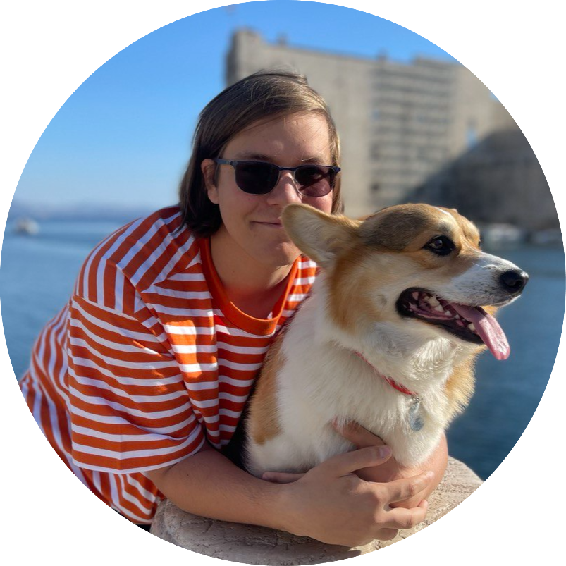

# About

I'm an ML/MLOps engineer, professional big data wrangler, Linux enthusiast, OSS believer and contributor, and a corgi owner.

{ width="600" }

My areas of interest are Deep Learning, production ML systems, distributed (Big Data) workloads, Kubernetes, good Python code, and I'm pretty active in the Dagster community.

I work at [TypeSafe](https://typesafe.ai).

I have a Telegram [channel](https://t.me/nadya_nafig) with random tech stuff.

<!-- ---

## Working with me

I am currently open for new job opportunities. I also provide consulting services. My CV can be found [here](https://app.enhancv.com/share/ccd95a52/?utm_medium=growth&utm_campaign=share-resume&utm_source=dynamic). -->
